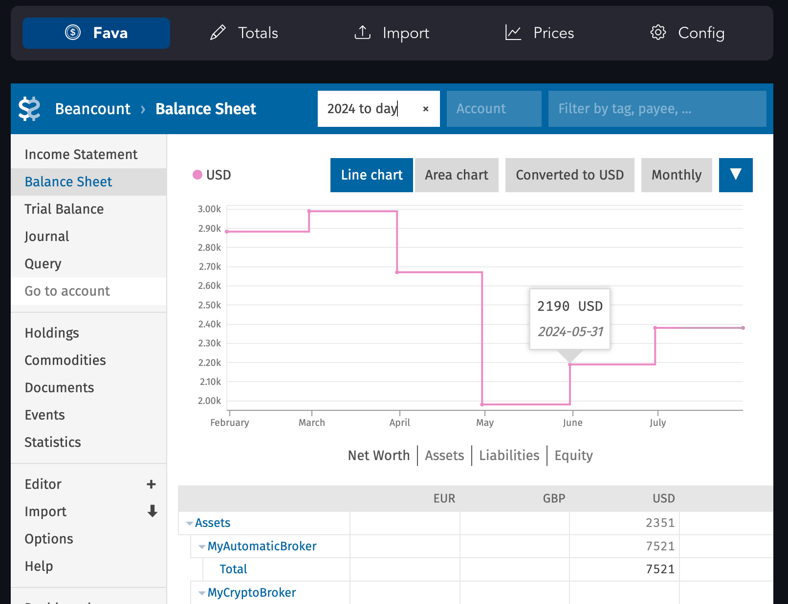

# [Lazy Beancount](https://lazy-beancount.xyz/)

[](LICENSE)


Lazy Beancount is [Beancount](https://github.com/beancount/beancount) accounting system packaged in Docker with batteries included:

- [Fava](https://github.com/beancount/fava) and [dashboards](https://github.com/andreasgerstmayr/fava-dashboards)
- [Beancount-import](https://github.com/jbms/beancount-import) and some specific [importers](https://github.com/Evernight/beancount-importers)
- [Streamlit](https://github.com/streamlit/streamlit)-based interface to minimize entry barrier and simplify some specific workflows.
- And pre-installed plugins: [beancount_share](https://github.com/Akuukis/beancount_share), [beancount_interpolate](https://github.com/Akuukis/beancount_interpolate), subset of [tarioch/beancounttools](https://github.com/tarioch/beancounttools)
- In progress: [fava-portfolio-returns](https://github.com/andreasgerstmayr/fava-portfolio-returns)

The primary goal is to enable **gradual** and **incremental** migration of personal finances into Beancount.



The full guide on usage is located at https://lazy-beancount.xyz/

# Setup (Docker compose)

    cd example_data
    docker compose up

Then go to http://localhost:8777/

Fava is also available on port 5003, importer interface is available on port 8101 (overridable via config in docker-compose.yml).

# Setup (Docker)

You can just pull image from the public repository:

    docker pull vandereer/lazy-beancount:latest

or build it yourself:

    git clone https://github.com/Evernight/lazy-beancount
    cd lazy-beancount

    docker build . -t lazy-beancount

To start, run:

    ./lazy_beancount.sh example_data

Use ```./lazy_beancount.sh data``` when you want to start adding your own data under the ```data``` directory.

Commands are available in the container like: 

    docker exec -it lazybean bean-price example_data/main.bean -i --date=2024-01-05

# Setup (local env via conda)

If you want to be able to upgrade individual packages and experiment with other (and your own) plugins or additional importers, you may go down this route.

First, clone this repository into your desired location

    git clone https://github.com/Evernight/lazy-beancount
    cd lazy-beancount

Install conda

    brew install miniconda

Then create and activate the environment

    conda create -n lazy-beancount-env python=3.12.3
    conda activate lazy-beancount-env

Install required packages in the environment

    pip3 install -r requirements.txt

Download repositories (TODO: move to pip installation as well)

    git clone https://github.com/beancount/beangulp
    git clone https://github.com/Evernight/beancount-valuation
    git clone https://github.com/Evernight/beancount-generate-base-ccy-prices
    git clone https://github.com/Evernight/beancount-importers/

Run Fava on your ledger from the repository folder

    PYTHONPATH=PYTHONPATH:. fava main.bean

Go to http://127.0.0.1:5000 and explore Fava.

(optionally) Install additional plugins:

    pip3 install git+https://github.com/andreasgerstmayr/fava-portfolio-returns.git

# Note
It's not recommended to expose the ports, various system and data through a public server unless you really know what you're doing. This setup has not been developed and tested for security and authentication when run as a public service.
