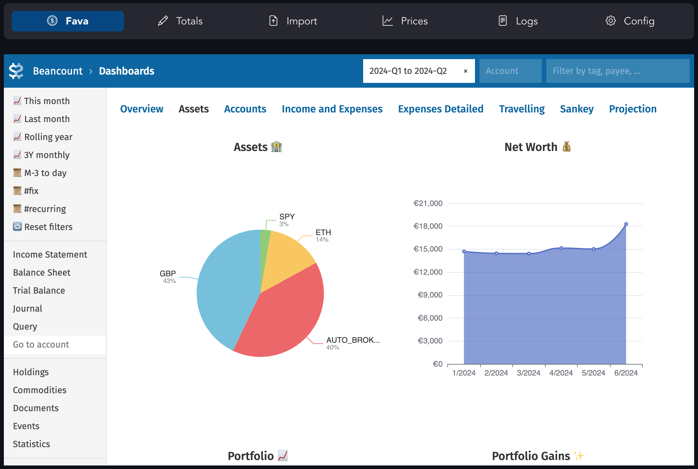
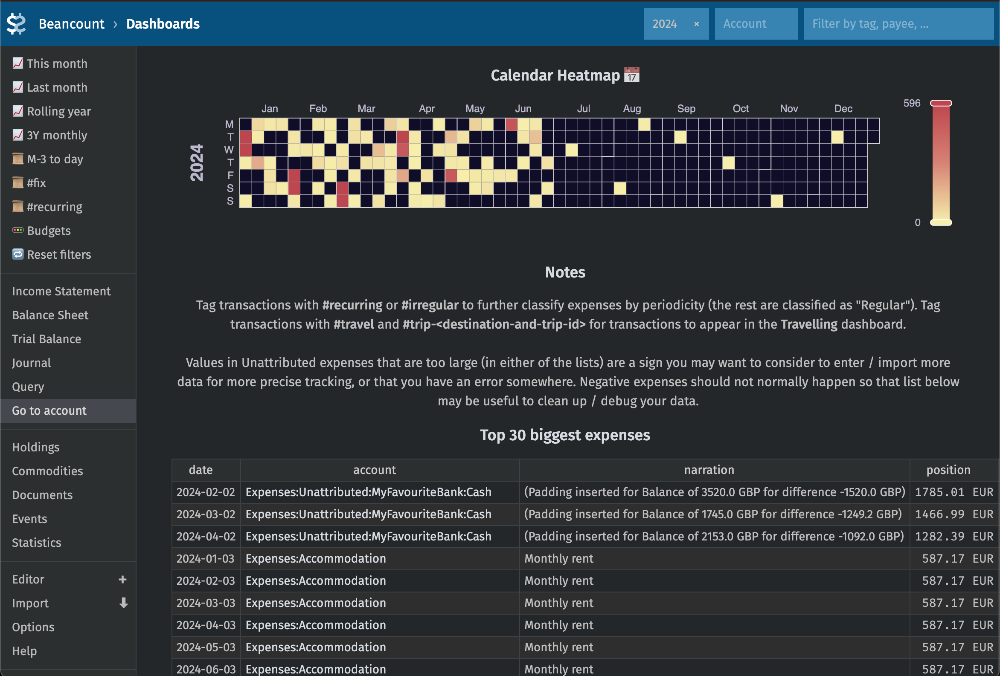

 

### [Lazy Beancount](https://lazy-beancount.xyz/)

[](LICENSE)
[](https://github.com/Evernight/lazy-beancount/releases)
[](https://hub.docker.com/r/vandereer/lazy-beancount)


Lazy Beancount is [Beancount](https://github.com/beancount/beancount) accounting system packaged in Docker with batteries included:

- [Fava](https://github.com/beancount/fava) with [fava-dashboards](https://github.com/andreasgerstmayr/fava-dashboards)
- [Beancount-import](https://github.com/jbms/beancount-import) for automatic transaction categorisation and review UI:
  - Importers set up to work out of the box:
    - Wise, Monzo, Revolut, IBKR ([Evernight/beancount-importers](https://github.com/Evernight/beancount-importers), [uabean](https://github.com/OSadovy/uabean/))
    - more importers can be integrated/enabled on request
  - configuration for multiple accounts using YAML config
  - UI for statement file upload
- Additional web interfaces ([Streamlit](https://github.com/streamlit/streamlit)-based) for:
  - regularly providing total values of the accounts for automatic balancing
  - fetching currency/commodity prices
- Pre-installed plugins: 
  - [beancount-lazy-plugins](https://github.com/Evernight/beancount-lazy-plugins): [valuation](https://github.com/Evernight/beancount-lazy-plugins?tab=readme-ov-file#valuation), [filter_map](https://github.com/Evernight/beancount-lazy-plugins?tab=readme-ov-file#filter_map), [group_pad_transactions](https://github.com/Evernight/beancount-lazy-plugins?tab=readme-ov-file#group_pad_transactions)
  - [beancount_share](https://github.com/Akuukis/beancount_share), [beancount_interpolate](https://github.com/Akuukis/beancount_interpolate)
  - [beancount_reds_plugins](https://github.com/redstreet/beancount_reds_plugins/)
  - [generate_base_ccy_prices](https://github.com/tarioch/beancounttools/blob/master/src/tariochbctools/plugins/generate_base_ccy_prices.py)
  - [fava-portfolio-returns](https://github.com/andreasgerstmayr/fava-portfolio-returns)
  - [fava_investor](https://github.com/redstreet/fava_investor)
- Configuration generator supporting any number of accounts (cash, investments, savings, crypto), multiple currencies and auto-conversions
- Extensive configuration example with comments, including common useful shortcuts and solutions to common problems 
- All tested together (manually) in a coherent setup

with the goal to enable **gradual** and **incremental** migration of personal finances into Beancount.



Full guide is located at https://lazy-beancount.xyz/. The approach follows these principles:
- Some of the values should be tracked precisely (e.g. net worth)
- Other things are an approximation (e.g. in expenses breakdown, unclassified or some misclassified entires are ok)
- Data entry should be automated or easy
- But it should be possible to track things to any level of precision if you choose to

# Screenshots
<p>





</p>

# Setup (docker-compose, recommended)

    git clone https://github.com/Evernight/lazy-beancount

    cd lazy-beancount/example_data
    env UID=$(id -u) GID=$(id -g) docker compose up

This will pull repository with the example and config templates, and also pull and run the latest version of the package from the [Docker Hub](https://hub.docker.com/r/vandereer/lazy-beancount/tags).
After this is done, go to http://localhost:8777/.

Fava is also available on port 5003, importer interface is available on port 8101 (ports are overridable via config in docker-compose.yml).

On Mac you can also remove ```user``` parameter from ```docker-compose.yaml``` and just use ```docker compose up```

# Setup (docker)

You can pull image from the public repository:

    docker pull vandereer/lazy-beancount:latest

or build it yourself:

    git clone https://github.com/Evernight/lazy-beancount
    cd lazy-beancount

    docker build . -t vandereer/lazy-beancount:latest

To start, run:

    ./lazy_beancount.sh example_data

Use ```./lazy_beancount.sh data``` when you want to start adding your own data under the ```data``` directory.

Commands are available in the container as: 

    docker exec -it lazybean bean-price example_data/main.bean -i --date=2024-01-05

You can also run container using Podman, via ```lazy_beancount_podman.sh``` script.

# Setup (local, conda, for development)

If you want to be able to upgrade individual packages and experiment with other (and your own) plugins or additional importers, you may go down this route.

First, clone this repository into your desired location

    git clone https://github.com/Evernight/lazy-beancount
    cd lazy-beancount

Install conda

    brew install miniconda

Then create and activate the environment

    conda create -n lazy-beancount-env python=3.12.3
    conda activate lazy-beancount-env

Install required packages in the environment

    pip3 install -r requirements.txt

Run Fava on your ledger from the repository folder

    PYTHONPATH=PYTHONPATH:. fava main.bean

Go to http://127.0.0.1:5000 and explore Fava.

## Note
I'd not recommend exposing the ports, various system and data through a public server unless you really know what you're doing. This setup has not been developed and tested for security and authentication when run as a public service.

# Acknowledgements
This is mostly an integration project and would not have been possible without all of the great code from authors and contributors of all the repositories mentioned above, the Beancount and plain text accounting community. Please support, star and otherwise contribute to respective projects.

# Similar projects
* [paisa](https://paisa.fyi/)
* [full-fledged-hledger](https://github.com/adept/full-fledged-hledger)
* [hledger-docker](https://github.com/adept/hledger-docker)

# Feedback and contributions
* Feel free to [create an issue](https://github.com/Evernight/lazy-beancount/issues) or contribute a fix.
* [lazy-beancount.xyz](https://lazy-beancount.xyz/) has giscus connected to enable commenting directly at pages.
* [matrix chat](https://matrix.to/#/#lazy-beancount:matrix.org) for small questions.
